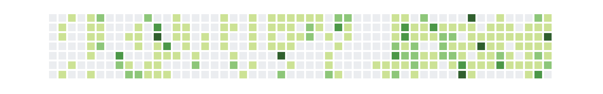
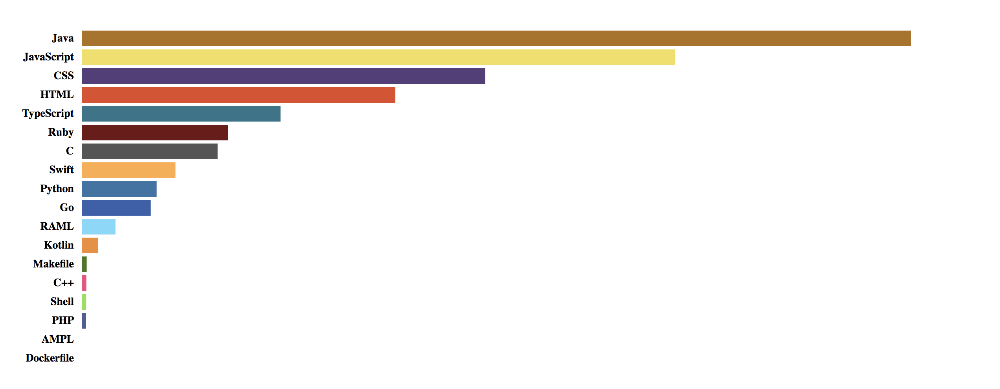

# Github Stats
> Embed Github profile every where you want

## Preview

### Commit Contributions


### Language Contributions


## Getting Started
### Installation
- Include `github-stats.js` in your html `head` tag:

```html
<script type="text/javascript" src="https://raw.githubusercontent.com/byliuyang/github-stats/master/src/github-stats.js"></script>
```

### Usage

To use Github Stats, add the following JavaScript to your website:

```javascript
(async () => {
        const GITHUB_USERNAME = 'byliuyang';
        const COMMITS_CONTAINER = '#github-commits';
        const LANGUAGES_CONTAINER = '#github-languages';

        const githubStats = await GithubStats(GITHUB_USERNAME);

        /* Render SVG for commit contributions */
        let commitsContribSVG = githubStats.commitsContribSVG({
            rows: 7,
            space: 4,
            rectWidth: 16,
            levelColors: [
                {
                    minCommits: 0,
                    color: '#ebedf0'
                },
                {
                    minCommits: 1,
                    color: '#c6e48b'
                },
                {
                    minCommits: 9,
                    color: '#7bc96f'
                },
                {
                    minCommits: 17,
                    color: '#239a3b'
                },
                {
                    minCommits: 26,
                    color: '#196127'
                }
            ]
        });

        let githubCommits = document.querySelector(COMMITS_CONTAINER);
        githubCommits.appendChild(commitsContribSVG);

        /* Render SVG for language contributions */
        let languageContribSVG = githubStats.languagesContribSVG({
            barHeight: 20,
            lineSpacing: 4,
            languageNameWidth: 100,
            fontSize: 14
        });

        let githubLanguageDistribution = document.querySelector(LANGUAGES_CONTAINER);
        githubLanguageDistribution.appendChild(languageContribSVG);
    })();
```

Please don't forget to replace `GITHUB_USERNAME` with **your** Github username and `*_CONTAINER` with the css selector where you want render the contributions inside.

### Options
#### Commit Contributions SVG
- **rows**: the number of rows in the graph
- **space**: the space between each square with unit in `px`.
- **rectWidth**: the width of the each square
- **levelColors**: the color of the squares varies based on the number of commits contributed on a day. `minCommits` refers to the minimal number of commits required to mark the square with color specified by the corresponding `color ` attribute.

#### Language Contributions SVG

- **barHeight**: the height of each rectangle
- **lineSpacing**: the space between each bar
- **languageNameWidth**: the width of language name
- **fontSize**: the font size of language names

## Changelog
### [0.0.2] - 2018-09-29
#### Added
- Added [example.html](examples/example.html)
- Added languages contributions svg generator
- Support caching Github API responses in local storage to mitigate rate limit and to reduce loading time

#### Updated
- Simplified initialization

### [0.0.1] - 2018-09-28
#### Added
- Add commit contributions generator

## Design Patterns
This project is engineered based on Behavior Delegation pattern mentioned in [You Don't Know Js](https://github.com/getify/You-Dont-Know-JS/blob/master/this%20%26%20object%20prototypes/ch6.md)


## Authors

- **Harry Liu** - *Initial work* - [byliuyang](https://github.com/byliuyang)

## License
This project is maintained under the MIT License.
