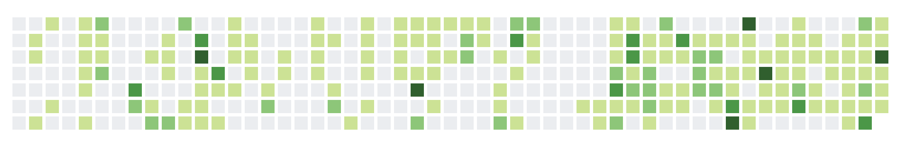

# Github Stats
> Embed Github profile every where you want

## Preview


## Getting Started
### Installation
- Download [github-stats.js]() and save it to your `assets` folder.
- Include `github-stats.js` in your html `head` tag:

```html
<script type="text/javascript" src="assets/scripts/github-stats.js"></script>
```

### Usage

To use Github Stats, add the following JavaScript to your website:

```javascript
const GITHUB_USERNAME = 'byliuyang';
const CONTAINER = '#github-contributions';

const githubStatsConfig = {
    rows: 7,
    space: 4,
    rectWidth: 16,
    levelColors: [
        {
            minCommits: 0,
            color: '#ebedf0'
        },
        {
            minCommits: 1,
            color: '#c6e48b'
        },
        {
            minCommits: 9,
            color: '#7bc96f'
        },
        {
            minCommits: 17,
            color: '#239a3b'
        },
        {
            minCommits: 26,
            color: '#196127'
        }
    ]
};

const githubStats = Object.create(GithubStats);
    githubStats.init(GITHUB_USERNAME)
        .then(() => {
            let svg = githubStats.contributionsSvg(githubStatsConfig);
            let githubCalender = document.querySelector(CONTAINER);
            githubCalender.appendChild(svg);
        });
```

Please don't forget to replace `GITHUB_USERNAME` with **your** Github username and `CONTAINER` with the css selector where you want to render the contributions inside.

### Options
- **rows**: the number of rows in the graph
- **space**: the space between each square with unit in `px`.
- **rectWidth**: the width of the each square
- **levelColors**: the color of the squares varies based on the number of commits contributed on a day. `minCommits` refers to the minimial number of commits required to mark the square with color specified by the corresponding `color ` attribute.

## Authors

- **Harry Liu** - *Initial work* - [byliuyang](https://github.com/byliuyang)

## License
This project is maintained under the MIT License.
